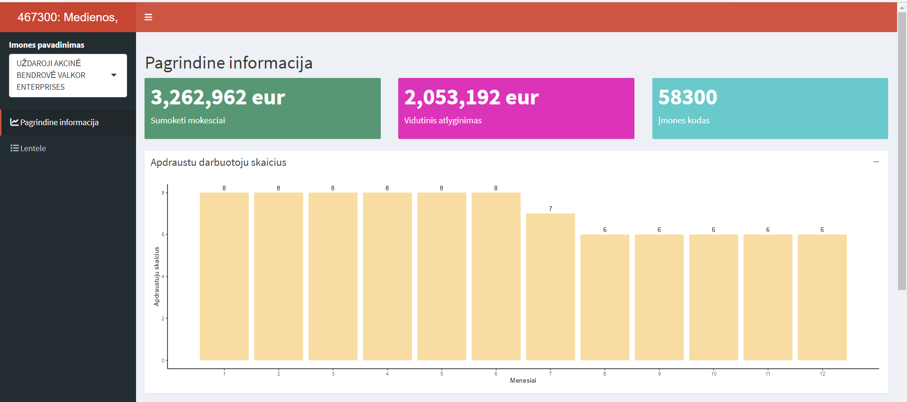
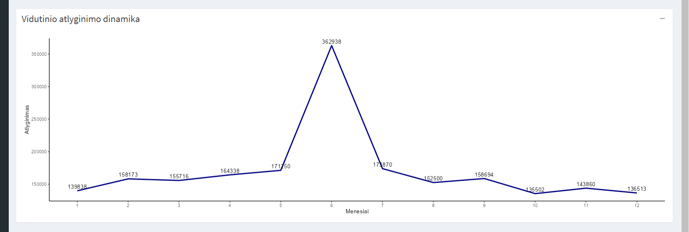
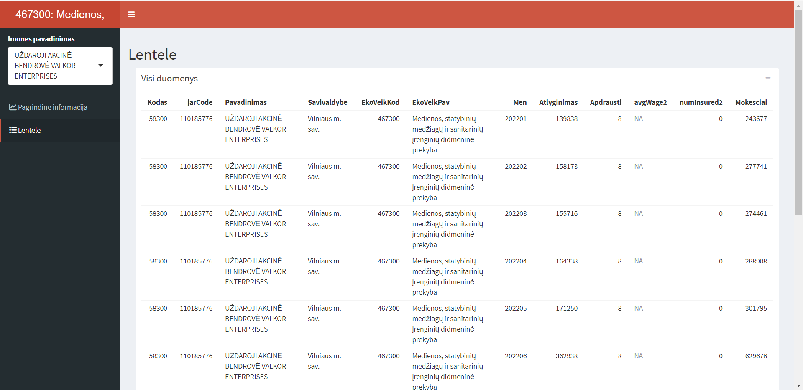

# R Laboratorinis darbas: duomenų vizualizacija

| Variantas | ecoActCode |
|------------- | ------------- |
| 7   |   467300    |

test 

### 1. Užduotis

Atsakymas:

.png)

Išvados:

### 2. Užduotis

Atsakymas:

.png)

Išvados: Kova, balandi ir lapkriti buvo padidejes vidutinis uzmokestis

### 3. Užduotis

Atsakymas:

.png)

Išvados:

### 4. Užduotis

Shiny R aplikacijos nuotrauka:

